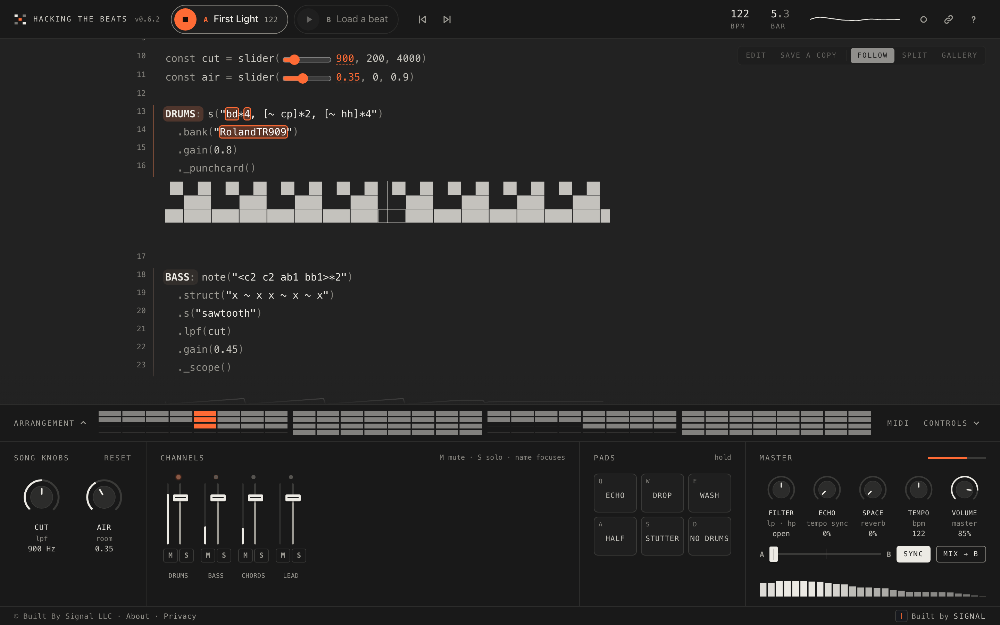

```text
██      ██   ██████     ████████ ██      ██ ██████████ ██      ██   ████████
██      ██ ██      ██ ██         ██    ██       ██     ████    ██ ██
██████████ ██████████ ██         ██████         ██     ██  ██  ██ ██    ████
██      ██ ██      ██ ██         ██    ██       ██     ██    ████ ██      ██
██      ██ ██      ██   ████████ ██      ██ ██████████ ██      ██   ████████

██████████ ██      ██ ██████████      ████████   ██████████   ██████   ██████████   ████████
    ██     ██      ██ ██              ██      ██ ██         ██      ██     ██     ██
    ██     ██████████ ████████        ████████   ████████   ██████████     ██       ██████
    ██     ██      ██ ██              ██      ██ ██         ██      ██     ██             ██
    ██     ██      ██ ██████████      ████████   ██████████ ██      ██     ██     ████████

▅▇▅▅▆▅▆█▇▇▇▅▅▅▄▅▆▄▃▃▁▂▄▃▄▄▂▂▃▃▅▇▅▆▆▄▆▇▇█▇▅▅▅▄▅▆▄▃▃▁▂▃▃▄▄▂▃▃▃▅▇▆▆▆▄▆▇▇█▇▅▅▅▄▅▅▄▄▃▁▂▃▃▄▄▂▃▃▃▅▆
```

**Music made by code, running live in your browser.** Each song is a [Strudel](https://strudel.cc) pattern. The code
is on stage: it lights up as it plays and draws its own visuals under the lines that make the sound. You mix it from
a two-deck DJ panel, and you can click into the code and change it while it plays.

**Live at [hackthebeats.com](https://hackthebeats.com)** · [What it is](#what-you-are-looking-at) ·
[Run it](#run-it) · [Write a beat](#write-a-beat) · [Deploy your own](#deploy-your-own) ·
[Security](#security-model) · [Licence](#licence-and-credits)



## What you are looking at

One bar of *First Light*, one of the demo beats in this repository. Left: what you hear. Right: the code that says so.

```text
  step     1 · · · 2 · · · 3 · · · 4 · · ·
           ┬───────┬───────┬───────┬───────
  kick     █ ░ ░ ░ █ ░ ░ ░ █ ░ ░ ░ █ ░ ░ ░      s("bd*4")
  clap     ░ ░ ░ ░ █ ░ ░ ░ ░ ░ ░ ░ █ ░ ░ ░      s("[~ cp]*2")
  hat      ░ ░ █ ░ ░ ░ █ ░ ░ ░ █ ░ ░ ░ █ ░      s("[~ hh]*4")
  bass     █ ░ ░ ░ █ ░ █ ░ ░ ░ █ ░ ░ ░ █ ░      .struct("x ~ x x ~ x ~ x")
```

A pattern is a sentence about time. `bd*4` is "four kicks in a bar". `[~ cp]*2` is "rest, clap, twice".
`bd(3,8)` is "three hits spread as evenly as they will go over eight steps":

```text
  bd(3,8)    █ ░ ░ █ ░ ░ █ ░
  hh(5,8)    █ ░ █ █ ░ █ █ ░
```

The site reads a song the way you just did. Every labelled line becomes a mixer channel, every `slider()` becomes
a knob, and the words in the pattern light up at the moment they sound.

```text
  const cut = slider(900, 200, 4000)        ──▶   a knob named CUT, 200 to 4000
  BASS: note("<c2 c2 ab1 bb1>*2")           ──▶   a channel named BASS: fader, meter, mute
    .lpf(cut)                               ──▶   turning the knob rewrites the 900 above
    ._scope()                               ──▶   a live waveform drawn under this line
```

## Run it

```bash
git clone https://github.com/BUILTBYSIGNAL/hackthebeats_com.git
cd hackthebeats_com
npm run dev
```

Open <http://localhost:5173>. Nothing to install: the Strudel engine is already bundled in
`vendor/strudel.bundle.js`, and the dev server has no dependencies. (The site is plain static files, but it must be
served over `http://`; opening `index.html` from disk will not work.)

A fresh copy has no accounts and nothing to configure. The whole instrument is open, and it plays the three demo
beats in `beats/`. Sounds are fetched from public sample packs as a song loads.

The dev server answers only to the machine it runs on, and never hands out a dotfile or `config.site.json`: the
project folder can hold songs and settings of your own. To try the site on a phone, start it with
`SERVE_HOST=0.0.0.0 npm run dev` and open the machine's address by its number.

## Write a beat

Drop a file into `beats/` and reload:

- a single song as plain text (`.strudel`, `.js` or `.txt`), or
- a pattern export from [strudel.cc](https://strudel.cc) (`.json`, any number of patterns in one file).

```js
/*
  @title Low Tide
  @by Your Name
  Any other lines here show up in the About panel, and in search results.
  mood: 0 minor, 1 major
  @try Glass pad: `s("sawtooth")` -> `s("triangle")`
*/
setcps(84/60/4)

const mood = 0                              // explained in the header: becomes a switch
const swell = slider(1200, 300, 5000)       // becomes a knob

PAD: n("<[0,2,4] [3,5,7] [-2,0,2] [1,3,5]>")  // a label makes a channel
  .scale(["A2:minor", "A2:major"][mood])
  .s("sawtooth").lpf(swell)
  ._scope()                                 // draws under the line
```

| In the code | On the deck |
| --- | --- |
| `NAME: pattern` or `$: pattern` | A channel: level, meter, mute, solo. Start the label with `_` and it comes up muted, ready to bring in. |
| `slider(value, min, max, step)` | A knob, named from the code around it. The slider is also drawn in the code; they are one control. |
| A plain number the header explains (`mood: 0 minor, 1 major` above `const mood = 0`) | A switch. Turning it re-runs the song. |
| `._punchcard()`, `._scope()`, and the other inline visuals | Drawn under that line while it plays. |
| `@title`, `@by`, and the other header lines | The song's name, credit, About text and page description. Strudel's shorthand `// "title" @by name` works too. |
| ``@try Label: `find` -> `replace` `` in the header | A suggestion over the stage. One tap rewrites the code and runs it; another tap puts it back. Several changes go in one line, separated by `;`, and ``in NAME`` keeps them to one track. A suggestion that would rewrite a knob's number, or no longer matches the code, is greyed out. Up to four are shown. |

The same pattern exported twice is shown once (the newest wins), and empty patterns are skipped.

**Your songs stay yours.** Everything in `beats/` is ignored by git except the three demos, so a song you drop in
there is never committed by accident. `npm run check:public` (also run on every push) refuses to let anything
else through. Notes, drafts and anything else not ready to ship can live in a `private/` folder: git ignores it,
the check refuses it, and the dev server will not serve it.

## The screen

```text
┌────────────────────────────────────────────────────────────────────────────────────────┐
│ HACKING THE BEATS   [■] A First Light 122   [▶] B Load a beat      122 BPM   5.3 BAR   │
├────────────────────────────────────────────────────────────────────────────────────────┤
│  13  DRUMS: s("bd*4, [~ cp]*2, [~ hh]*4")         EDIT  SAVE A COPY  FOLLOW  SPLIT     │
│  14    .bank("RolandTR909")                                                GALLERY     │
│  16    ._punchcard()                                                                   │
│        ▀▄▀▄▀▄▀▄▀▄▀▄▀▄▀▄▀▄▀▄▀▄▀▄▀▄▀▄▀▄▀▄     the code is the stage: words light up      │
│  18  BASS: note("<c2 c2 ab1 bb1>*2")          as they sound, visuals draw beneath      │
├────────────────────────────────────────────────────────────────────────────────────────┤
│ ARRANGEMENT   ▬▬▬▬▬▬▬▬ ▬▬▬▬▬▬▬▬ ▬▬▬▬▬▬▬▬ ▬▬▬▬▬▬▬▬   which tracks play in each bar      │
├──────────────┬───────────────────────────┬────────────────────┬────────────────────────┤
│ SONG KNOBS   │ CHANNELS                  │ PADS               │ MASTER                 │
│              │                           │                    │                        │
│  (◔)   (◔)   │   ┃     ┃     ┃     ┃     │ ECHO  DROP  WASH   │ FILTER ECHO SPACE      │
│  CUT   AIR   │  ─╂─   ─╂─   ─╂─   ─╂─    │ HALF  STUT  NO DR  │ TEMPO  VOLUME          │
│              │   ┃     ┃     ┃     ┃     │                    │                        │
│              │  M S   M S   M S   M S    │ hold, or shift to  │ A ━━━━━┿━━━━━ B        │
│              │ DRUMS  BASS CHORDS LEAD   │ latch              │ SYNC   MIX → B         │
└──────────────┴───────────────────────────┴────────────────────┴────────────────────────┘
```

### The stage

- **Editing.** Click in the code (or press **Edit**, which is there before anything plays) and type. On a touch
  screen a tap is for the music, so editing starts with **Edit**. `Ctrl+Enter` (`⌘↩` on a Mac) or **Update** runs
  your changes without stopping the music; a mistake is reported in plain words, with the line it is on, and the
  last good version keeps playing. Knobs and channels follow the new code. `Esc` or **Done** leaves the code.
- **Saving.** Nothing you type is saved until you say so. Lines that differ from the saved song are marked down
  the side, the stage bar says **Unsaved changes**, and the deck's title gets a dot. **Save** writes over your own
  song; **Save as new** keeps your version as a new song and leaves the original as it was; **Revert** throws the
  changes away. Choosing another song, signing out or closing the page with unsaved changes asks first.
- **Follow.** The code glides to whichever track has just come in, and otherwise tours the tracks that are
  playing. Scrolling by hand pauses it for a few seconds.
- **Focus.** Click a channel's name to isolate that track's code and visual; click again (or `Esc`) to release.
- **Split** shows both decks' code side by side. **Gallery** is full screen, code only, larger type.
- Click a track label in the code to mute it; click a highlighted number to jump to its knob.
- **Song map.** The sections of the code, listed in the empty margin beside it (or behind **Map** in the stage
  bar when the window is too narrow): setup (tempo, sample packs, the header), knobs and switches, parts, and the
  helpers parts share. Each is described from the code itself (its sounds, its effects in plain words, the knobs it
  uses, a comment its author left beside it) when you rest the pointer on it or tab to it. Click one to glide the
  code there; **Edit this part** opens the code with the caret at its start. A part's dot pulses with its track and
  dims when it is muted.
- **Try.** A song's `@try` lines are offered over the code, top left. One tap makes the change and runs it, with the
  changed line marked; another tap puts it back. Nothing is saved by trying, so they work without an account.
- **First steps.** A short list in the corner of the stage, opened by itself after the first play: press play, turn
  a knob, mute a track, try a change, then sign in (or, with an account, keep your version and share it). Each step
  ticks itself off when it is done, and **Show me** points at where. It can be closed (the ribbon's **Steps**
  button brings it back) or dismissed for good; the About sheet has **Show the first steps again**.

### The deck

| Section | What it does |
| --- | --- |
| **Decks A / B** | Two songs at once. Click a deck to focus it (its knobs and channels are shown); click again to choose a beat for it. |
| **Song knobs** | One per `slider()` in the code. Turning a knob rewrites the number in the code as you go. |
| **Channels** | One per labelled pattern. Level with a real meter, mute, solo. |
| **Pads** | Hold to engage, Shift-click to latch (or switch **Latch** on: tap on, tap off): echo throw, filter drop, reverb wash, half-time, stutter, no drums. |
| **Master** | Filter, tempo-synced echo, reverb, tempo, volume, and the crossfader. A limiter keeps the output under full scale; the meter turns orange while it is working. |
| **Sync / Mix** | With Sync on, a deck started while the other plays comes in on its bar line at its tempo. **Mix** starts the other deck that way and fades across over eight bars. |
| **Arrangement** | Which tracks play in each of 32 bars. Click a bar to jump there; open it for track names. |

Positions are remembered per song in the browser; **Reset** returns a song to what its code says.

- **Record** (the dot in the top bar, or `R`) captures the mix to a 16-bit WAV file, about 10 MB a minute.
- **Share** (the link icon) opens the share sheet (see [Songs of your own](#songs-of-your-own)). A built-in beat is
  shared as a link to its own page that carries the deck's knob, switch, channel and tempo settings.
- **MIDI.** Press *MIDI*, click any knob, fader, pad or button, then move a control on your hardware. Bindings are
  remembered. Needs a browser with Web MIDI (Chrome, Edge, Firefox).

```text
  Space  play / stop        ← →     previous / next beat   Q W E   echo · drop · wash
  X      switch deck        [ ]     jump four bars         A S D   half · stutter · no drums
  M      mix to the other   1 … =   mute channels 1–12     F G     follow · gallery
  R      record             B  ?    song list · help       Esc     leave the code

  Ctrl+Enter   run the edited code        Ctrl+S   save        Ctrl+.   stop
```

On a Mac these are `⌘↩`, `⌘S` and `⌘.`, and the site shows them that way. While you are typing in the code, the
single-key shortcuts are off.

### Where the sound goes

Everything after Strudel is a plain WebAudio chain, so the master controls respond at once (`js/master.js`):

```text
  deck A ──▶ bus A ─┐
                    ├─▶ crossfader ─▶ high-pass ─▶ low-pass ─┬─▶ dry ────────────┐
  deck B ──▶ bus B ─┘                                        ├─▶ echo (synced) ──┤
                                                             └─▶ reverb ─────────┤
                                                                                 ▼
              speakers ◀─┬─ volume ◀─ soft clip ◀─ limiter ◀─────────────────────┘
              meters   ◀─┤
              recorder ◀─┘
```

## Songs of your own

In the song list you can start a **New** song (from a one-track drum loop, or a full song with drums, bass and a
lead), **Import** a strudel.cc export or a `.js` / `.strudel` file, and
**Export** all your songs as one strudel.cc-format JSON file. Each of your songs can be renamed, duplicated, shared
and deleted from its `⋯` menu. To keep a version of a built-in beat, press **Save as my song** after editing, or
**Save a copy** to take it as it is. A copy remembers where it came from (the beat, or the shared song and who
shared it) and says so in the song list and on the curtain: "Remix of …". It never records the original's owner
or account.

Without an account your songs live in the browser you made them in. Signed in, they are kept in your account and
follow you between devices.

A song is private unless you share it. **Share** (or **Share…** in the song's `⋯` menu) opens the share sheet:

- a switch for sharing by link, the link with **Copy**, and **Share…** where the device has a share menu of its own;
- if the deck has changes that are not saved, a warning, with **Save and share** (a built-in beat: **Save as my song
  and share**), because the link always plays the latest saved version;
- what the person who gets the link will find, and **Record audio**;
- while it is shared, **Let the site feature this**: an offer to the site's editors, who may put it on the
  [community shelf](#from-the-community). Untick it to withdraw it.

The link is the song's own address on the player, `…/s/<uuid>` (or `…/#song=<uuid>` on a site without
[link previews](#link-previews)): a random identifier made when sharing is switched on, which says nothing about the
song or its owner. Switching sharing off closes the link, and switching it on again makes a new one, so the old
link stays closed, even if its record is left behind (the player checks that a link is the song's current one). A
link that leads nowhere says so on the page.

### Someone else's song never runs as you

A song is code. If a stranger's song ran on the main site, it could act as the signed-in listener: read their
songs, change them, share them. So a shared link opens on a second address that a browser treats as a different
site:

```text
   example.org                              play.example.org
  ┌────────────────────────────┐           ┌────────────────────────────┐
  │ the instrument             │           │ the player                 │
  │ you are signed in          │   link    │ nobody is signed in        │
  │ your songs are here        │ ────────▶ │ nothing is saved here      │
  │                            │           │ the shared song plays,     │
  │                            │           │ with its knobs and pads    │
  │ a copy opens here, and     │ ◀──────── │ "Edit a copy"              │
  │ asks before it runs        │           │ kept out of search results │
  └────────────────────────────┘           └────────────────────────────┘
```

On the player, whoever follows the link sees who shared it and can play with the song's knobs, channels and pads;
nothing they do is kept. **Edit a copy** takes the song to the main site, where (after signing in) the question
reads **Run and keep a copy**: one click runs it and makes it theirs, crediting the original. The question stays,
because any page could send someone to a `#copy=` address. With no second address configured (on localhost, say),
a shared song opens in place behind the same question.

### From the community

The song list has a shelf between My songs and Beats: songs people share that the site's editors picked, newest
first, at most 48. It is only on the main site, and hidden while it is empty.

- **Only what the link already shows.** The owner offers a shared song, and the admin features it. Its entry,
  `community/<uuid>` (the link's UUID), holds the title, the credit, the sharer's name, the tempo, the number of
  tracks, up to 300 characters of the header notes and the remix credit: never the code, the owner's account or
  the song's id (`js/community-core.js`).
- **Opening one.** Signed out, it plays on the shared-song player. Signed in, it opens on the deck chosen, behind
  the same "run this?" question as any shared song (headed *From the community*), because its owner can change
  the code after it was featured.
- **Withdrawing.** Unticking the offer, switching sharing off or deleting the song takes it off the shelf at once.
  The admin's own visits also take off any entry whose song is no longer shared and offered. Unticking leaves the
  link itself working for whoever has it; only switching sharing off closes it.

## Accounts and roles

Accounts are optional, and off in a fresh copy. With them on (see [Deploy your own](#deploy-your-own)):

| Who | What they get |
| --- | --- |
| Not signed in | The **featured beat**, the code lighting up, and an introduction with a Sign in button. Once it plays, its controls are theirs: knobs, channels, pads and the master effects (positions are remembered in their browser), and clicking a track label in the code mutes it. Editing, saving, sharing, recording, the second deck and MIDI need an account. |
| Signed in | The whole instrument: both decks, knobs, mixer, pads, editing, their own songs, sharing, recording, MIDI. Their beats are the featured one and any the admin has opened to members. A new member is given **User demo**, their own copy of the featured beat, to change as they like. |
| Admin | The same, plus every beat, and the **Admin** sheet (account button → Admin). |

Every beat belongs to the admin alone unless it is the featured one or has been opened to members. Nobody else can
see that such a beat exists. Signing in is one click with Google, and creates the account. Someone who follows a
shared song's link can listen without one.

**Who is an admin.** An account with a marker document, `admins/<uid>`, in Firestore. Create it in the Firebase
console (it can be empty; the uid is on the Authentication → Users page). Nobody can write that collection from the
site, so nothing in a browser can grant the role, and the site learns the role by asking the database a question
only an admin is allowed to ask.

**The Admin sheet** has two parts:

- *Beats*: the site's beats, in order. Add one of your own songs or import a strudel.cc export, choose the
  **featured** beat, switch a beat to **Members** (or back to yours alone), rename, replace a beat's code with one
  of your songs, remove. A beat keeps its address when it is renamed. Every change also rewrites the public catalog
  (titles and descriptions of the featured beat and the members' beats, no code), which is what other visitors and
  the site build read.
- *Shared songs*: every song anyone is currently sharing, with **Open** and **Switch sharing off**. A song that
  was switched off stays with its owner, who can still edit it but cannot share it again.
- *From the community*: on *Shared songs*, a song its owner offered has **Feature** (or **Unfeature**), and the
  rest say *not offered*. The shelf holds 48 at most. Switching a song's sharing off also takes it off the shelf.

## Pages and addresses

| Address | What it is |
| --- | --- |
| `/` | The player, opened on the last beat you played. |
| `/beats/<slug>` | The player opened on one beat. The slug comes from the title: `/beats/low-tide`. |
| `/about` | What the site is, the list of beats, credits, source and contact. |
| `/privacy` | The privacy notice. |
| `/s/<uuid>` | On the shared-song player: a shared song's own address. With link previews on, it is answered with the song's title, description and picture before any script runs (see below). |

The address follows deck A: choosing a beat moves to its address, and back and forward move between the beats you
opened. On the built site every address is a real page with its own title, description, canonical address and
link-preview tags, readable without running any script. Each page also has its own share picture (Open Graph,
1200×630): a beat's shows the beat's name, credit and tempo over a pattern drawn from the beat, so no two look
alike. The titles and descriptions are worked out from each song's header comment, so a good header is what makes
a good search result.

## Configuration

The code carries no site's settings. A site's own values live in `config.site.json` at the top of the project,
which git ignores. Copy the example and fill it in:

```bash
cp config.site.example.json config.site.json
```

| Setting | What it is for |
| --- | --- |
| `firebase` | The web app config from the Firebase console (`apiKey`, `authDomain`, `projectId`, `appId`). Accounts are off without it. |
| `appOrigin` | The site's address. Used for canonical addresses and the sitemap. |
| `shareOrigin` | A second address serving the same files, where shared songs are played. |
| `contact` | An email address shown on the About and Privacy pages. |
| `linkPreviews` | `true` makes share links `/s/<uuid>` addresses, answered by the link-preview function so they unfurl as the song. Needs the function deployed, and so Firebase's Blaze plan. Off (the default), share links are `#song=<uuid>` and every one unfurls with the site's general card. |
| `analytics` | A Google Analytics measurement id. On unless a visitor opts out: a first visit shows a notice with an Opt out button, the Privacy page can change the answer, and a browser sending Global Privacy Control counts as opted out. Never loaded on the shared-song player. Check what the law where your visitors live asks for; some places require asking first. |

The dev server and the build hand these to the page as `site-config.js`. A Firebase web config identifies a
project; it is not a password, and every visitor's browser receives it. What protects the data is
[`firestore.rules`](firestore.rules).

## Deploy your own

```bash
npm install
npm run build      # writes dist/: exactly what the public site serves
npm run deploy     # builds, checks, then publishes dist/ and the database rules to Firebase
```

`dist/` holds the site's own files, a page for every address, `sitemap.xml`, `robots.txt`, the share pictures, and
`source/hacking-the-beats-<version>.tar.gz`: the project's source, which the About page links to, because the AGPL
asks a public site to offer its source to the people using it. Sample audio is never published; the hosted site
streams samples from their packs.

Without accounts, the build publishes the songs in `beats/` (except any marked `"publish": false` in
`beats/titles.json`) and any static host will do. With accounts, the beats live in the database and the build
publishes **no song files**: only the featured beat's page carries code.

### One-time Firebase setup

1. `firebase login` (the Firebase CLI: `npm i -g firebase-tools`).
2. In the [Firebase console](https://console.firebase.google.com), add Firebase to a Google Cloud project.
3. **Authentication → Sign-in method**: enable **Google**. Under **Settings → Authorized domains** add the site's
   domain. Do not add the shared-song player's domain.
4. **Firestore Database**: create a database in production mode.
5. **Hosting**: the project needs two sites, one for each address. Tell the CLI which is which (this writes
   `.firebaserc`, which git ignores; `.firebaserc.example` shows the result):

   ```bash
   firebase use --add your-project-id
   firebase hosting:sites:create your-project-id-play
   firebase target:apply hosting app your-project-id
   firebase target:apply hosting play your-project-id-play
   ```

6. **Project settings → Your apps**: add a web app and put its config in `config.site.json`, with the contact
   address and the two addresses.
7. Read `privacy.html` and `about.html` through and make them yours: they name the operator of the original site.
8. `npm run deploy:first`. A new database has no beats, so this one time the build publishes the song files for
   the admin to adopt. Then connect the domains under **Hosting → Add custom domain** and add the DNS records it
   shows at your registrar.
9. Sign in on the site, then create `admins/<your uid>` in the Firebase console. Open the Admin sheet and press
   **Publish the site's own beats**. From then on the beats come from the database, and `npm run deploy` stops
   publishing song files (and refuses to fall back to them).

To have Google's sign-in screen name your domain, set `authDomain` to the site's own domain and add
`https://<your domain>/__/auth/handler` as an authorized redirect URI on the project's OAuth web client.

### Link previews

A chat app that unfurls a link runs no scripts, and the part of an address after `#` never reaches a server, so a
`#song=` link can only ever show the site's general card. With `linkPreviews` on, a share link is the player's own
address for the song, `/s/<uuid>`, and a small Cloud Function answers it (`functions/`, logic in
`js/share-page-core.js`):

```text
  play.example.org/s/<uuid>             the player's page, with the song's title, description, credit and a
                                        1200×630 picture (og: and twitter: tags, noindex), then the player as usual
  play.example.org/s/<uuid>/card.png    the picture: the song's title and punchcard, drawn from SVG (js/card-core.js)
                                        with the fonts in functions/fonts (Inter and JetBrains Mono, OFL)
```

- **It says nothing a link does not already show.** The page carries the title, the credit and the sharer's name,
  never the code, the owner's account or the song's id; the player still reads the song itself, live.
- **A closed link says nothing at all.** Sharing switched off, a link replaced by a newer one (even if its record
  lingers), a blocked song or a link that never was are all answered the same way, with the general card. The
  function reads past the database's rules, so it checks what they would.
- **Caching.** A live page is kept for five minutes and its picture for fifteen by the hosting's cache, so a link
  whose sharing is switched off can still show its title that long; chat apps keep their own copies for longer.
- **Cost.** Each uncached answer is one function call and two database reads; `maxInstances` is 10. Normal use is
  far inside the free allowances, but a Blaze plan has no ceiling of its own: set a budget alert in Google Cloud.

To set it up: switch the project to the Blaze plan, run `npm --prefix functions ci` once, set `linkPreviews: true`,
and `npm run deploy` (which deploys the function along with the site whenever `linkPreviews` is on). The first
function deploy may ask how long to keep old build images; a day or two is plenty. An organization policy that
forbids public access to Cloud Run services stops the deploy until it allows `allUsers` to invoke this one.

The build lists anything that should be dealt with first. `deploy` refuses to publish while accounts are on
without a contact address, if the version shown on the site does not match `package.json`, or if it would publish
song files a database was supposed to hold.

## Security model

The browser is never trusted. Every promise the site makes is kept by [`firestore.rules`](firestore.rules), which
the accounts test suite exercises against the Firestore emulator.

```text
  users/{uid}/songs/{id}   its owner reads and writes · anyone reads it while it is shared
                           an admin can do one thing to it: switch its sharing off
  shares/{uuid}            a link holder learns which song it names · nobody can list them
  beats/{id}               featured: anyone · members: signed in · the rest: admin only
  catalog/public           titles and descriptions, no code: anyone reads, admin writes
  community/{uuid}         the community shelf, no code: anyone reads (48 at a time) · the admin writes, only
                           for a song its owner offered · the admin or that owner removes
  admins/{uid}             written only from the Firebase console
  everything else          closed
```

- **Shared code is isolated.** Someone else's song runs on a separate origin with no session
  ([above](#someone-elses-song-never-runs-as-you)).
- **The "run this?" answer cannot be taken from you.** Neither address will load inside another site's page, and
  the Run button only wakes a moment after the question appears or the window comes back to the front, so a
  click meant for something else does not land on it.
- **One address each.** Opened anywhere else that serves the same files (the host's own `<project>.web.app`
  name, say), the player goes to `appOrigin` before it does anything, because the two-address setup is not in
  force there. A copy on your own machine or network is left alone.
- **Private songs cannot be discovered.** Nobody can list another person's songs, and share links are random
  UUIDs that name nothing. The link-preview function answers only a live link, and only with what the player
  would show anyway.
- **No secrets in the repository.** Site settings, the Firebase project file, credentials and personal songs are
  ignored by git, and `tools/check-public.mjs` fails the push if a key, a token, an email address, a home-folder
  path, a song outside the demos, or a word from your own private list (`.private-terms`) turns up in a tracked
  file. CI runs the same check. Where that list exists, every commit not yet pushed is held to it too: who it
  says made it, its message, and each file in it, including one deleted since.
- **Analytics can be switched off** by any visitor, and never runs on the shared-song player. It is given a
  page's public title, never the title of someone's own song.

Found a problem? Please report it privately: see [SECURITY.md](SECURITY.md).

## Tests

```bash
npm install                        # once: the tests and the build need their tools
npm test                           # unit tests: analysis, addresses, share links, WAV, MIDI
npm run check:public               # nothing private is about to be published
npx playwright install             # once, for the browser suites
npm run test:browsers              # plays, mixes, edits, visits every page: three engines
npm run test:browsers -- --built   # the same against dist/ (after npm run build)
npm run test:songs                 # loads and plays every song in beats/
npm run test:songs -- --offline    # the same with all remote requests blocked
npm run test:accounts              # sign-in, saving, sharing, roles and the security rules,
                                   # on local emulators
```

`test:accounts` needs the Firebase CLI, Java (for the Firestore emulator; Homebrew's `openjdk` is found even when it
is not on the `PATH`) and the link-preview function's packages (`npm --prefix functions ci`, once). Chromium runs on a silent virtual
audio output; Firefox and WebKit play through the speakers, turned right down after the levels are measured.

## Samples and offline use

Sounds are fetched from their sample packs as a song loads, and a service worker (`sw.js`) keeps the site and
every sound it has played available offline on repeat visits. To make a copy that needs no network at all:

```bash
npm install
npm run samples    # downloads only what the songs in beats/ use, into vendor/samples/
```

`npm run samples -- --clean` goes back to streaming. Check the licence of any third-party sample pack before
publishing a copy of it. If a song uses a sound that no loaded pack provides, that part stays silent and its
channel name is underlined.

## Rebuilding the engine

`vendor/strudel.bundle.js` is built from the unmodified Strudel npm packages. `tools/strudel-entry.mjs` lists what
goes in; versions are pinned in `package.json`. The Firebase SDK is bundled the same way and only loaded when
accounts are configured.

```bash
npm install
npm run build:vendor       # Strudel
npm run build:firebase     # Firebase Auth + Firestore Lite
```

`npm version patch` (or `minor`, `major`) updates `package.json`, the version shown on the site (`js/version.js`)
and the offline cache name in `sw.js` together.

## Map

```text
  index.html ............ the player (the build makes every /beats/<slug> page from it)
  about.html, privacy.html, 404.html, sw.js
  site-config.js ........ empty here; a site's settings arrive through it (config.site.json)
  firestore.rules ....... who may read and write what
  functions/ ............ the link-preview function (bundled into functions/dist/ by tools/build-functions.mjs)
  beats/ ................ three demo songs; yours go here too, and stay on your machine
  css/ .................. tokens, layout, stage, deck, controls; page.css for reading pages
  js/
    main.js ............. boot and wiring
    config.js ........... settings and their defaults       version.js
    runtime.js .......... shared Strudel runtime: scope, sample packs, evaluation
    player.js ........... one deck: editor, scheduler, song, tempo, seek, pad effects
    stage.js ............ the animated code view (CodeMirror)    camera.js follows the music
    analyze.js .......... reads a song's source: tracks, sliders, switches, header
    mixer.js ............ per-track mute, solo, level and metering
    master.js ........... master bus: deck buses, crossfader, effects, limiter
    deck.js ............. the controls section               controls.js knob, fader, pad
    visuals.js .......... scope, spectrum, arrangement ribbon   arrangement.js computes it
    recorder.js ......... WAV recording    share.js mix links    midi.js controller bindings
    library.js .......... the built-in beats   crate.js the song picker   thumbs.js
    songs.js ............ My songs: browser storage and account sync
    cloud.js ............ Google sign-in and Firestore
    admin.js ............ the Admin sheet      beats-core.js beats and their catalog
    routes-core.js ...... page addresses, titles and descriptions
    share-page-core.js .. what a shared song's /s/ address answers     card-core.js its picture
    analytics.js ........ Google Analytics, with its opt-out
    share-sheet.js ...... the share sheet           tries.js a song's @try suggestions, one tap each
    community-core.js ... the community shelf: which songs may be on it, and what their entries say
    onboarding.js ....... First steps
    outline.js .......... the song map beside the code      outline-core.js finds its sections
    keys-core.js ........ key names as the visitor's keyboard has them (⌘ on a Mac)
    errors-core.js ...... a song's mistakes in plain words
    *-core.js ........... the pure logic of each, shared with the build and the unit tests
  tools/ ................ dev server, site build, share pictures, engine build,
                          sample vendoring, the publish check
  tests/ ................ unit tests and browser suites
  vendor/ ............... the bundled Strudel engine and Firebase SDK
```

## Licence and credits

```text
  ♪  Strudel ............ © Strudel contributors · AGPL-3.0-or-later · codeberg.org/uzu
  ♪  TidalCycles ........ the language Strudel brings to the browser
  ♪  Sounds ............. public sample packs that belong to their authors; none stored here
  ♪  This project ....... © Built By Signal LLC · AGPL-3.0-or-later · see LICENSE
```

Hacking the Beats bundles Strudel and is released under the same licence, the GNU Affero General Public License v3
or later, with no warranty. If you run a changed copy as a public site, the licence asks you to offer your source
to the people using it; the build does that for you with the archive linked from the About page. Keep the credit
in place.

The three demo beats in `beats/` are in the public domain (CC0).

The site at [hackthebeats.com](https://hackthebeats.com) is owned and operated by Built By Signal LLC
([builtbysignal.com](https://builtbysignal.com)).
